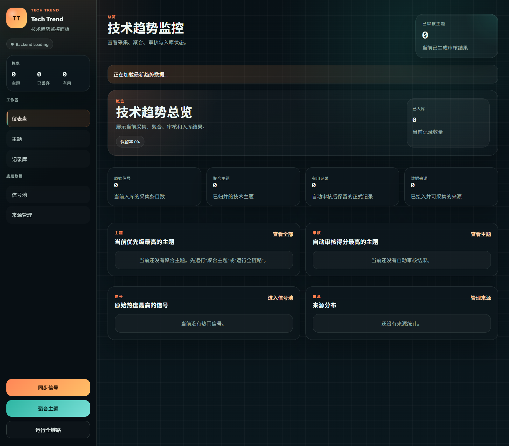

# Tech Trend

`Tech Trend` 是一个技术趋势监控系统，用于从多来源技术信号中提取主题、完成自动审核，并沉淀最终记录。

## 界面截图



## 项目功能

### 多来源信号采集

当前支持的技术信息来源包括：

- Hacker News
- arXiv
- Patent
- Technical Book
- GitHub Trending
- Stack Overflow
- Dev.to
- Product Hunt
- TechCrunch
- Reddit Tech

### 主题聚合

系统会将原始信号统一处理为主题，包含：

- 信号标准化
- 关键词提取
- 主题合并
- 多维度评分
- 状态分类

### 自动审核

系统内置自动审核规则，对主题进行综合评估，主要维度包括：

- 时效性
- 来源可信度
- 技术准确性
- 实用性
- 安全风险
- 合规风险

审核结果分为：

- `useful`
- `reference`
- `discarded`

其中 `useful` 结果会直接进入记录库。

### 前端工作台

前端提供以下核心页面：

- 仪表盘
- 主题列表
- 主题详情
- 记录库
- 信号池
- 来源管理

## 系统流程

```text
Signals
  -> Topic Aggregation
  -> Scoring
  -> Auto Review
  -> Records
```

## 技术架构

### 前端

- React 18
- Vite
- React Router
- CSS

### 后端

- FastAPI
- SQLAlchemy
- SQLite
- httpx
- feedparser
- Playwright

### 核心模块

```text
backend/app/
├── api/          # HTTP API
├── collectors/   # 多来源采集器
├── core/         # 配置与数据库连接
├── models/       # 数据模型
├── schemas/      # Schema
├── services/     # 服务层
└── topics/       # 主题聚合、评分、审核与记录

frontend/src/
├── components/   # UI 组件
├── pages/        # 页面
└── utils/        # 前端工具函数
```

## 适用场景

`Tech Trend` 适合用于：

- 观察技术社区热点变化
- 跟踪研究与产业信号
- 筛选值得保留的技术主题
- 建立技术趋势记录库
